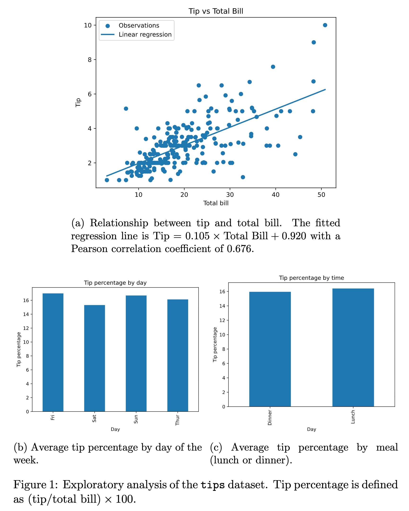

### 01 Data visualisation and plotting

In this section, we will create a publication-style figure from a small example
dataset.

The goal is not to learn every plotting feature in Python. The goal is to think
about figures as part of the research workflow: they should be reproducible,
easy to update, and clear enough for a reader to understand.

We will use the `tips` dataset, a small dataset containing restaurant bills and
tips. The dataset includes:

- total bill in dollars
- tip in dollars
- sex of the bill payer
- whether there were smokers in the party
- day of the week
- time of day
- size of the party

The dataset is documented here:
<https://rdrr.io/cran/reshape2/man/tips.html>.

## What makes a figure useful/good?




## Create a plotting script

Create a folder for scripts if it does not already exist:

```shell
mkdir -p scripts
```

Create a file called `scripts/plot_tips.py`.

Start with the imports and data preparation:

```python
from pathlib import Path

import matplotlib.pyplot as plt
import numpy as np
import pandas as pd
import seaborn as sns


Path("figures").mkdir(exist_ok=True)

url = "https://raw.githubusercontent.com/mwaskom/seaborn-data/master/tips.csv"
tips = pd.read_csv(url)

tips["tip_percentage"] = 100 * tips["tip"] / tips["total_bill"]
```

This reads the data and adds a derived column for the tip percentage.

## Build the figure in Python

When a figure has multiple panels, create the layout in Python rather than
assembling panels manually afterwards.

This helps keep:

- panel sizes consistent
- axes aligned
- fonts consistent

Add a subplot layout:

```python
fig, axes = plt.subplot_mosaic(
    """
    AB
    AC
    """,
    figsize=(9, 4.5),
    sharex=False,
    sharey=False,
    gridspec_kw={
        "hspace": 0.5,
        "wspace": 0.3,
        "height_ratios": [1, 1],
        "width_ratios": [1, 0.7],
    },
)
```

The `subplot_mosaic` layout gives names to panels. In this layout, panel `A`
takes the full height on the left, while panels `B` and `C` are stacked on the
right.

## Add the first panel

Panel `A` shows the relationship between total bill and tip.

```python
slope, intercept = np.polyfit(tips["total_bill"], tips["tip"], 1)

x = np.linspace(tips["total_bill"].min(), tips["total_bill"].max(), 100)
y = slope * x + intercept

axes["A"].scatter(
    tips["total_bill"],
    tips["tip"],
    label="Observations",
    alpha=0.7,
)

axes["A"].plot(
    x,
    y,
    color="black",
    linewidth=2,
    label=rf"Linear fit: $y = {slope:.3f}x + {intercept:.3f}$",
)

axes["A"].legend(frameon=False)
axes["A"].set_xlabel("Total bill ($)")
axes["A"].set_ylabel("Tip ($)")
```

This panel uses a scatter plot because we want to show individual observations.
The fitted line is added to summarise the overall trend.

## Choose the right plot type

For panels `B` and `C`, we might first think of using bar plots of average tip
percentage by day and time. Averages can be useful, but they hide the spread of
the data.

For this example, box plots are more informative because they show variation as
well as central tendency.

```python
day_order = ["Thur", "Fri", "Sat", "Sun"]
day_data = [
    tips.loc[tips["day"] == day, "tip_percentage"]
    for day in day_order
]

axes["B"].boxplot(
    day_data,
    tick_labels=day_order,
    patch_artist=True,
    boxprops=dict(facecolor="orange", alpha=0.7),
    medianprops=dict(color="black", linewidth=2),
    whiskerprops=dict(color="black"),
    capprops=dict(color="black"),
)

axes["B"].set_xlabel("Day")
axes["B"].set_ylabel("Tip percentage")

time_order = ["Lunch", "Dinner"]
time_data = [
    tips.loc[tips["time"] == meal, "tip_percentage"]
    for meal in time_order
]

axes["C"].boxplot(
    time_data,
    tick_labels=time_order,
    patch_artist=True,
    boxprops=dict(facecolor="orange", alpha=0.7),
    medianprops=dict(color="black", linewidth=2),
    whiskerprops=dict(color="black"),
    capprops=dict(color="black"),
)

axes["C"].set_xlabel("Time")
axes["C"].set_ylabel("Tip percentage")
```

When panels are meant to be compared, use the same axis limits:

```python
ymax = max(
    tips["tip_percentage"].max(),
    axes["B"].get_ylim()[1],
    axes["C"].get_ylim()[1],
)

axes["B"].set_ylim(0, ymax * 1.05)
axes["C"].set_ylim(0, ymax * 1.05)
```

## Use colour deliberately

Colour should communicate information. It should not be added just to make the
figure look busy.

Useful reasons to use colour include:

- distinguishing different groups
- keeping the same category visually consistent across panels
- highlighting one important comparison
- matching a colour scheme used throughout a paper

For this figure, orange box plots are enough. The figure does not need a
different colour for every day of the week.

## Add panel labels and final styling

Panel labels make it easier to refer to parts of the figure in a caption or in
the text of a paper.

Add labels and final styling:

```python
for ax in axes.values():
    sns.despine(ax=ax)

for letter, key in zip("abc", ["A", "B", "C"]):
    ax = axes[key]
    bbox = ax.get_position()
    fig.text(
        bbox.x0 - 0.04,
        bbox.y1 + 0.01,
        letter,
        fontsize=16,
        fontweight="bold",
    )

fig.savefig("figures/tips_summary.pdf", bbox_inches="tight")
fig.savefig("figures/tips_summary.png", dpi=300, bbox_inches="tight")
```

Save vector formats such as PDF for papers when possible. PNG files are useful
for slides, websites, and quick sharing.

## Complete script

The full `scripts/plot_tips.py` script is:

```python
import matplotlib.pyplot as plt
import numpy as np
import pandas as pd
import seaborn as sns


url = "https://raw.githubusercontent.com/mwaskom/seaborn-data/master/tips.csv"
tips = pd.read_csv(url)

tips["tip_percentage"] = 100 * tips["tip"] / tips["total_bill"]

fig, axes = plt.subplot_mosaic(
    """
    AB
    AC
    """,
    figsize=(9, 4.5),
    sharex=False,
    sharey=False,
    gridspec_kw={
        "hspace": 0.5,
        "wspace": 0.3,
        "height_ratios": [1, 1],
        "width_ratios": [1, 0.7],
    },
)

slope, intercept = np.polyfit(tips["total_bill"], tips["tip"], 1)

x = np.linspace(tips["total_bill"].min(), tips["total_bill"].max(), 100)
y = slope * x + intercept

axes["A"].scatter(
    tips["total_bill"],
    tips["tip"],
    label="Observations",
    alpha=0.7,
)

axes["A"].plot(
    x,
    y,
    color="black",
    linewidth=2,
    label=rf"Linear fit: $y = {slope:.3f}x + {intercept:.3f}$",
)

axes["A"].legend(frameon=False)
axes["A"].set_xlabel("Total bill ($)")
axes["A"].set_ylabel("Tip ($)")

day_order = ["Thur", "Fri", "Sat", "Sun"]
day_data = [
    tips.loc[tips["day"] == day, "tip_percentage"]
    for day in day_order
]

axes["B"].boxplot(
    day_data,
    tick_labels=day_order,
    patch_artist=True,
    boxprops=dict(facecolor="orange", alpha=0.7),
    medianprops=dict(color="black", linewidth=2),
    whiskerprops=dict(color="black"),
    capprops=dict(color="black"),
)

axes["B"].set_xlabel("Day")
axes["B"].set_ylabel("Tip percentage")

time_order = ["Lunch", "Dinner"]
time_data = [
    tips.loc[tips["time"] == meal, "tip_percentage"]
    for meal in time_order
]

axes["C"].boxplot(
    time_data,
    tick_labels=time_order,
    patch_artist=True,
    boxprops=dict(facecolor="orange", alpha=0.7),
    medianprops=dict(color="black", linewidth=2),
    whiskerprops=dict(color="black"),
    capprops=dict(color="black"),
)

axes["C"].set_xlabel("Time")
axes["C"].set_ylabel("Tip percentage")

ymax = max(
    tips["tip_percentage"].max(),
    axes["B"].get_ylim()[1],
    axes["C"].get_ylim()[1],
)

axes["B"].set_ylim(0, ymax * 1.05)
axes["C"].set_ylim(0, ymax * 1.05)

for ax in axes.values():
    sns.despine(ax=ax)

for letter, key in zip("abc", ["A", "B", "C"]):
    ax = axes[key]
    bbox = ax.get_position()
    fig.text(
        bbox.x0 - 0.04,
        bbox.y1 + 0.01,
        letter,
        fontsize=16,
        fontweight="bold",
    )

fig.savefig("figures/tips_summary.pdf", bbox_inches="tight")
fig.savefig("figures/tips_summary.png", dpi=300, bbox_inches="tight")
```

Run the script:

```shell
python scripts/plot_tips.py
```

or:

```shell
python3 scripts/plot_tips.py
```

## Save the change with git

After the script runs and the figure looks reasonable, check what changed:

```shell
git status
```

You should see the plotting script and the generated figure files.

Add the plotting script:

```shell
git add scripts/plot_tips.py
```

Inspect what is staged:

```shell
git diff --staged
```

Whether to add generated figures depends on the project. For a paper
repository, it is often useful to commit final figures so that the manuscript
can be compiled without rerunning every analysis step.

If you want to track the generated figure files too, add them:

```shell
git add figures/tips_summary.pdf figures/tips_summary.png
```

Check the staged changes again:

```shell
git diff --staged
```

Commit the change:

```shell
git commit -m "Add tips summary figure"
```

## Colour example

The same figure can also be used to show how colour choices affect the visual
message. Use colour consistently: here, tip percentage panels use orange and
total bill panels use blue.

```python
fig, axes = plt.subplot_mosaic(
    """
    ABC
    ADE
    """,
    figsize=(13.5, 4.5),
    sharex=False,
    sharey=False,
    gridspec_kw={
        "hspace": 0.5,
        "wspace": 0.3,
        "height_ratios": [1, 1],
        "width_ratios": [1, 0.7, 0.7],
    },
)

slope, intercept = np.polyfit(tips["total_bill"], tips["tip"], 1)

x = np.linspace(tips["total_bill"].min(), tips["total_bill"].max(), 100)
y = slope * x + intercept

axes["A"].scatter(
    tips["total_bill"],
    tips["tip"],
    label="Observations",
    alpha=0.7,
    color="tab:green",
)

axes["A"].plot(
    x,
    y,
    color="black",
    linewidth=2,
    label=rf"Linear fit: $y = {slope:.3f}x + {intercept:.3f}$",
)

axes["A"].legend(frameon=False)
axes["A"].set_xlabel("Total bill ($)")
axes["A"].set_ylabel("Tip ($)")

day_order = ["Thur", "Fri", "Sat", "Sun"]
day_tip_data = [
    tips.loc[tips["day"] == day, "tip_percentage"]
    for day in day_order
]

axes["B"].boxplot(
    day_tip_data,
    tick_labels=day_order,
    patch_artist=True,
    boxprops=dict(facecolor="orange", alpha=0.7),
    medianprops=dict(color="black", linewidth=2),
    whiskerprops=dict(color="black"),
    capprops=dict(color="black"),
)

axes["B"].set_xlabel("Day")
axes["B"].set_ylabel("Tip percentage")

time_order = ["Lunch", "Dinner"]
time_tip_data = [
    tips.loc[tips["time"] == meal, "tip_percentage"]
    for meal in time_order
]

axes["C"].boxplot(
    time_tip_data,
    tick_labels=time_order,
    patch_artist=True,
    boxprops=dict(facecolor="orange", alpha=0.7),
    medianprops=dict(color="black", linewidth=2),
    whiskerprops=dict(color="black"),
    capprops=dict(color="black"),
)

axes["C"].set_xlabel("Time")
axes["C"].set_ylabel("Tip percentage")

ymax = max(
    tips["tip_percentage"].max(),
    axes["B"].get_ylim()[1],
    axes["C"].get_ylim()[1],
)

axes["B"].set_ylim(0, ymax * 1.05)
axes["C"].set_ylim(0, ymax * 1.05)

day_bill_data = [
    tips.loc[tips["day"] == day, "total_bill"]
    for day in day_order
]

axes["D"].boxplot(
    day_bill_data,
    tick_labels=day_order,
    patch_artist=True,
    boxprops=dict(facecolor="tab:blue", alpha=0.7),
    medianprops=dict(color="black", linewidth=2),
    whiskerprops=dict(color="black"),
    capprops=dict(color="black"),
)

axes["D"].set_xlabel("Day")
axes["D"].set_ylabel("Total bill ($)")

time_bill_data = [
    tips.loc[tips["time"] == meal, "total_bill"]
    for meal in time_order
]

axes["E"].boxplot(
    time_bill_data,
    tick_labels=time_order,
    patch_artist=True,
    boxprops=dict(facecolor="tab:blue", alpha=0.7),
    medianprops=dict(color="black", linewidth=2),
    whiskerprops=dict(color="black"),
    capprops=dict(color="black"),
)

axes["E"].set_xlabel("Time")
axes["E"].set_ylabel("Total bill ($)")

ymax = max(
    tips["total_bill"].max(),
    axes["D"].get_ylim()[1],
    axes["E"].get_ylim()[1],
)

axes["D"].set_ylim(0, ymax * 1.05)
axes["E"].set_ylim(0, ymax * 1.05)

for ax in axes.values():
    sns.despine(ax=ax)

for letter, key in zip("abcde", ["A", "B", "C", "D", "E"]):
    ax = axes[key]
    bbox = ax.get_position()
    fig.text(
        bbox.x0 - 0.04,
        bbox.y1 + 0.01,
        letter,
        fontsize=16,
        fontweight="bold",
    )
```
